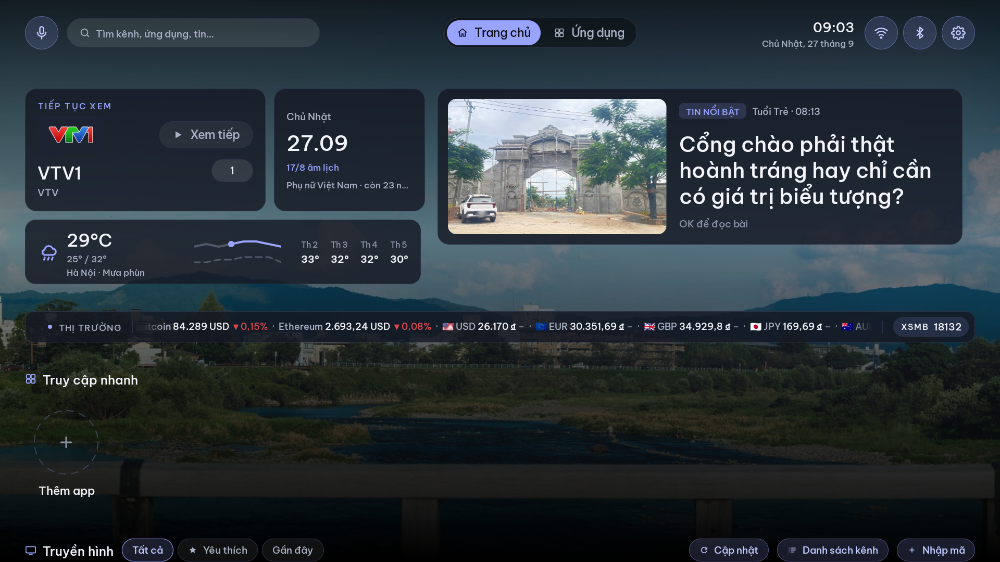
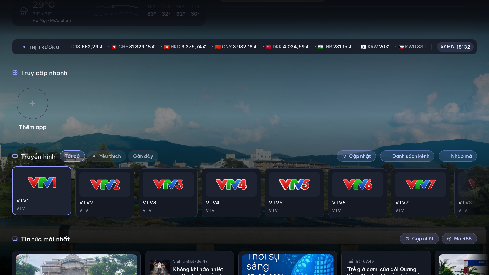
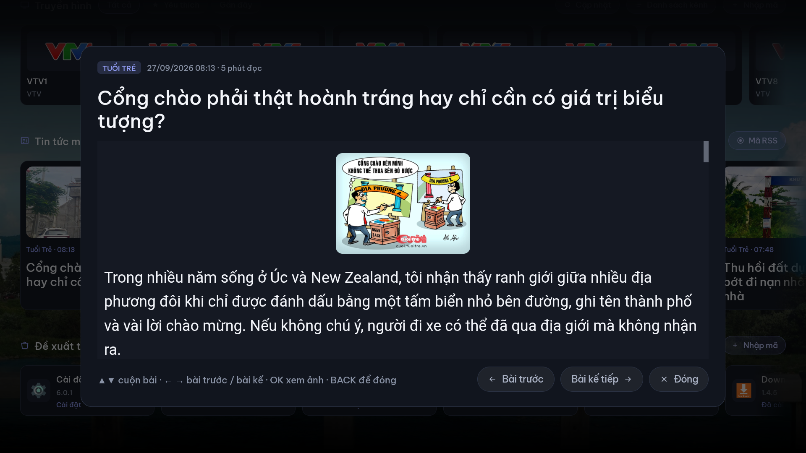
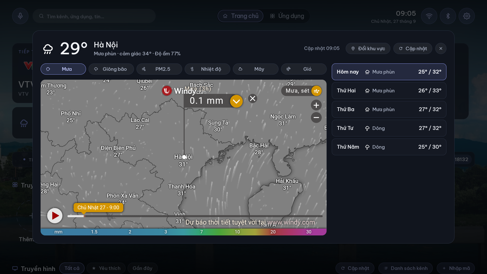
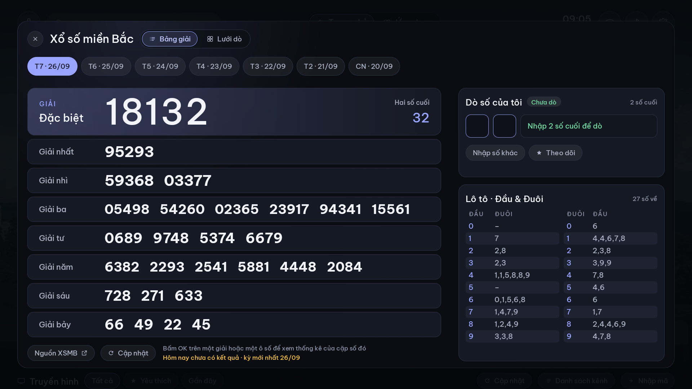
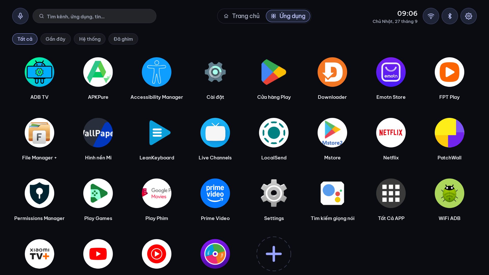
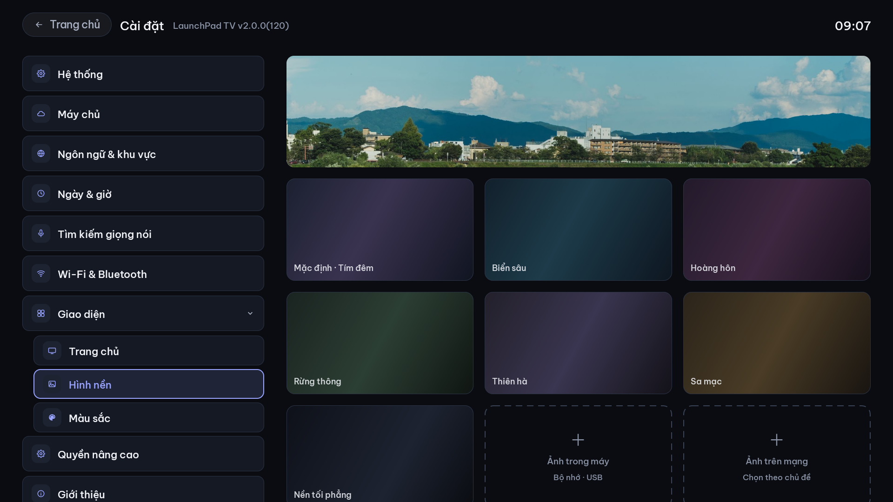
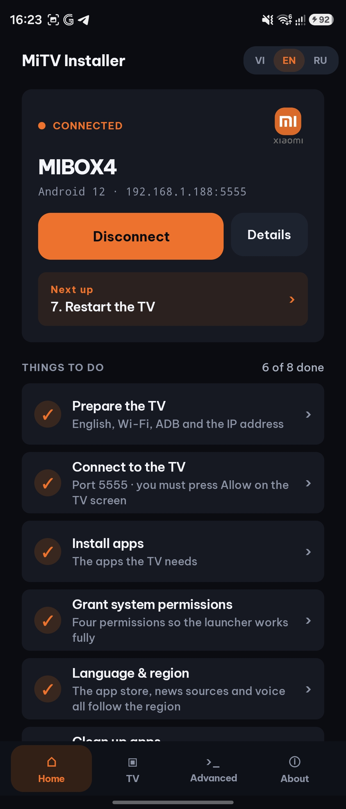
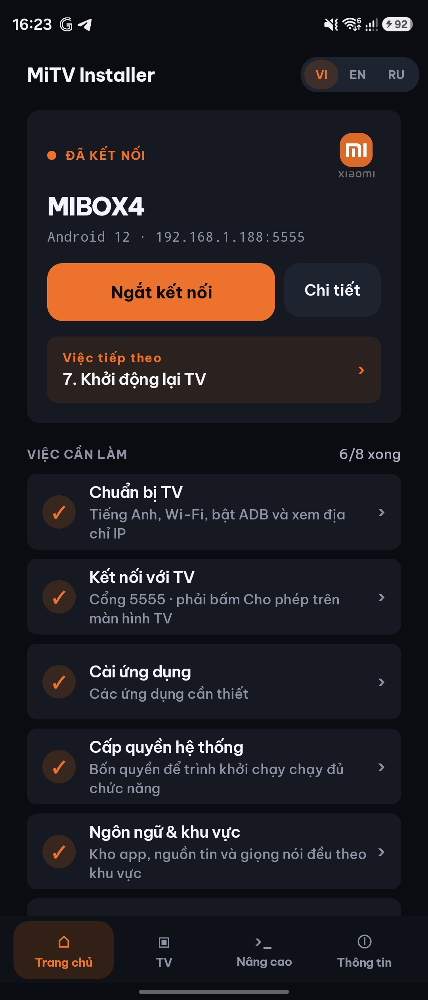

  
  

<h1 align="center">LaunchPad TV</h1>

<strong>Turn on the TV and everything you care about is already there.</strong>

  
  
  
  
  
  

Tiếng Việt · English · Русский · 日本語 · 한국어 · 繁體中文 · Deutsch · Français

  
  
  

LaunchPad TV is a clean, fast home screen for Xiaomi Mi Box and Mi TV. Your channels, the day's news, the weather and your apps come together on one screen, made for the remote.

## Download

| App | Runs on | Version | Download |
|---|---|---|---|
| **LaunchPad TV** | Android TV box / Smart TV | <!-- tv-version -->2.0.1 (121)<!-- /tv-version --> | <!-- tv-link -->[LaunchPadTV-2.0.1-121.apk](https://github.com/launchpad2/tv/releases/download/tv-v2.0.1-121/LaunchPadTV-2.0.1-121.apk)<!-- /tv-link --> |
| **MiTV Installer** | Android phone | <!-- installer-version -->1.2.1 (43)<!-- /installer-version --> | <!-- installer-link -->[MiTV-Installer-1.2.1-43.apk](https://github.com/launchpad2/tv/releases/download/installer-v1.2.1-43/MiTV-Installer-1.2.1-43.apk)<!-- /installer-link --> |

Android 6.0 or later. Free, and it keeps itself up to date.

## A home screen that works for you

Most TV home screens are built to sell you something. LaunchPad TV is built to get you to what you want, faster.

**Everything on one screen.** Pick up where you left off, see what's new today, and open any app without digging through menus.

**Watch what you love.** Your channels sit right on the home screen. Favorites and recently watched are one click away.

**Stay in the know.** News you can read in full on the big screen, weather at a glance, and the market and lottery results you check every day.

**Make it yours.** Show only what you use, set your own wallpaper, and pick the color that fits your living room.

| | |
|---|---|
|  |  |
|  |  |
|  |  |

## Bring your own channels, news and apps

LaunchPad TV works out of the box, and it goes as far as you want. Point it at your own channel playlist, your favorite news sources or your own app store with a simple 6-character code. Ten channels or ten thousand, it is your line-up.

> [!TIP]
> **Make your own line-up.** The [content guide](docs/content-guide.md) shows how to build a channel playlist, a news list or an app store and turn it into a code, with ready-to-use example files.

## Set up in minutes, from your phone

**MiTV Installer** does the setup for you. No cables, no computer, no tech know-how. Open it on your phone, connect to the TV over Wi-Fi, and follow the checklist. It installs LaunchPad TV and gets your TV ready to go.

Available in English, Vietnamese and Russian.

| | |
|---|---|
|  |  |

## Get started

1. Download [MiTV Installer](#download) to your Android phone.
2. Put your phone and TV on the same Wi-Fi.
3. Open the app and follow the steps. Your new home screen is a few minutes away.

Want your own channels, news or app store on the TV? Follow the [content guide](docs/content-guide.md).

Prefer to do it yourself? Download [LaunchPad TV](#download) straight onto your TV and install it.
